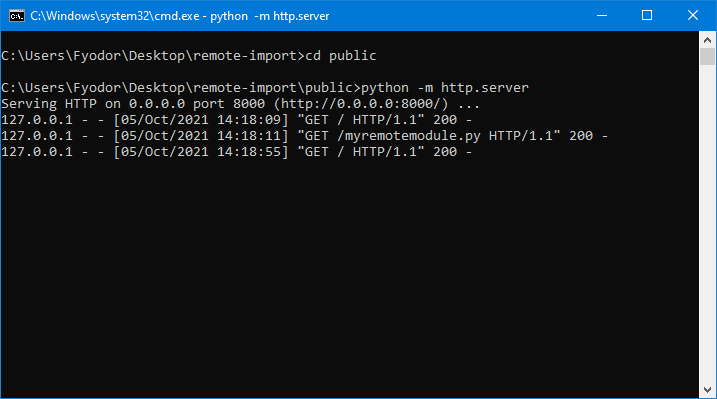
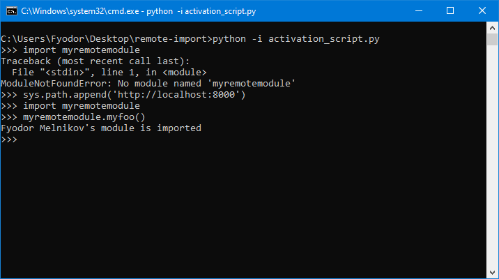
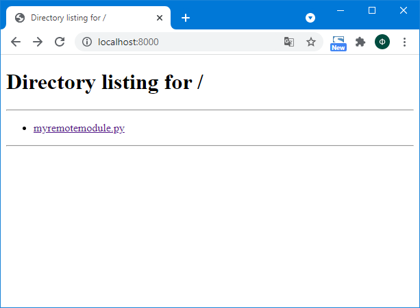
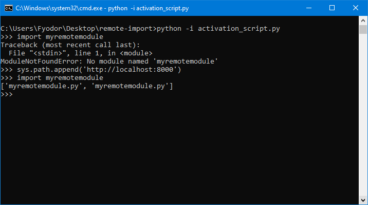
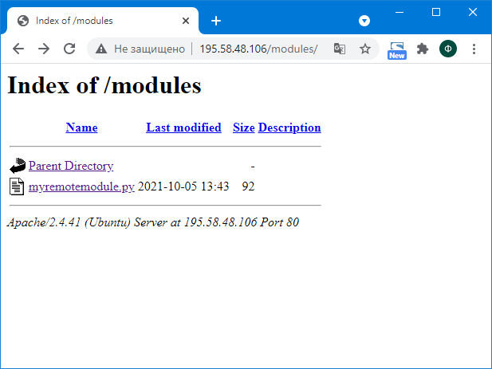
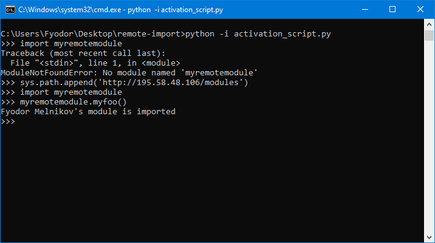

# Лабораторная работа 3. Реализация удалённого импорта

1. Запуск сервера



2. Импорт модуля



Сервер при отправке запроса выдаёт содержимое файла или индексную страницу:



Функция `url_hook` запрашивает индексную страницу и с помощью регулярного выражения получает список файлов .py, которые хранятся на сервере. Для того, чтобы импортировать модуль, достаточно, чтобы его название с расширением .py содержалось в тексте страницы.

Если в индексной странице указывается ссылка, то модуль добавляется в список дважды, т. к. в коде страницы ссылка указывается следующим образом:

```html
<a href="myremotemodule.py">myremotemodule.py</a>
```



Для работы удалённого импорта сервер должен выдавать индексную страницу со списком модулей в формате `(module_name).py` и отдавать файлы модулей.




